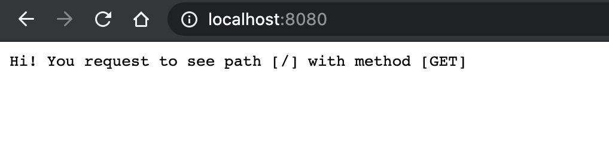

# Requirement
- Implement a minimal HTTP echo server

# Prerequisites
- Python 3.6.3

# Notes
- Only `GET` and `POST` methods are implemented

# Usage
```sh
python3 server.py <host> <port>
```

# Example
- Server
```sh
python3 server.py localhost 8080
Serve via address: localhost:8080
127.0.0.1 [2020-07-10 05:25:24] "POST / HTTP/1.1" 200
127.0.0.1 [2020-07-10 05:25:25] "POST / HTTP/1.1" 200
127.0.0.1 [2020-07-10 05:25:26] "POST / HTTP/1.1" 200
127.0.0.1 [2020-07-10 05:25:26] "POST / HTTP/1.1" 200
^CReceived exit signal from keyboard . . .
```

- curl client
```sh
curl -X GET localhost:8080/
Hi! You request to see path [/] with method [GET]

curl -X POST localhost:8080/path
Hi! You request to see path [/path] with method [POST]

curl -X PUT localhost:8080/path
Not implemented
```

- Browser (screenshot)



